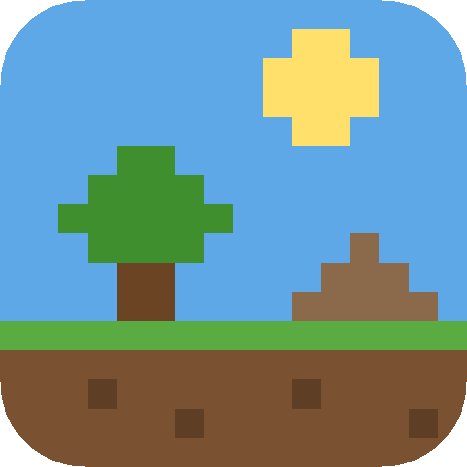

# Pixel Terrarium

A living 2D pixel sandbox that runs on your desktop. Leave it alone and the world
goes about its day: ants forage for leaves and dig out their colony, sharks cruise
the reef hunting fish, deer graze, foxes chase rabbits, fireflies come out at
dusk and it rains, snows or storms on its own. Or take over and **play god**.



## Running it

**New to this?** Follow the step-by-step [installation guide](INSTALL.md).

```bash
npm install
npm start          # desktop app (Electron)
```

No build step is needed. The simulation itself is plain HTML + JavaScript, so you
can also open `src/index.html` directly in a browser, or run `npm run web` and visit
http://localhost:8080.

To build installers (Windows `.exe`, macOS `.dmg`, Linux `.AppImage`):

```bash
npm run dist
```

## Game modes

The game opens on a **main menu** with a random biome playing in the background.
Press ☰ in the dock to get back to it at any time.

### 🏝️ Sandbox

Pick any of the 29 biomes from a list and play god in it.

### 🌍 World

One big world (3 to 12 screens wide, 2 screens high) where many biomes blend into
each other. Ground height, sky, scenery, water colour, temperature and weather
all fade over a wide transition instead of stopping at a hard edge.

Neighbouring biomes follow geography rules. Deep sea only borders the open sea,
coral reefs sit between beach and sea, deserts never border the arctic or ice
age, mountains lead into taiga or snowy hills, and swamps sit next to wetlands,
rivers or rainforest. The beehive, ant hill and backyard lawn are a different
scale and are left out.

Before the world is built, a setup screen lets you:

- **Biomes:** switch biomes off, one by one or by group (cold, temperate, warm & dry, tropical, coast & ocean).
- **Creatures:** switch off whole categories (mammals, birds, fantasy, ...) or single species.
- **Events:** choose how often disasters happen on their own, and which ones.
- **World:** size and an optional seed.

Ores (coal, copper, tin, iron, gold) and oil pockets are buried underground.
Only the area around the camera (and any towns) runs at full speed, so even
huge worlds stay smooth.

### 🏛️ Colony

A World-mode map with your own tribe, plus up to three rival colonies. Your
people pick their own jobs: gathering berries, foraging, hunting, fishing,
chopping trees (and replanting them), quarrying, mining ore, farming, building
and studying. You help them out as a god:

- **🏛️ Colony panel:**
  - **Colony:** population, resources and current research. Sliders set what people focus on (food, wood, stone, mining, research, building, military). Auto research and auto build can be switched off.
  - **Divine help:** inspiration, harvests, gifts of timber or stone, or a blessed child (with a cooldown).
  - **Rivals:** a list of the rival colonies, with buttons to fly the camera there.
- **🔬 Tech tree:** 41 technologies across 8 ages. Click one to research it next.
- **🔨 Build:** order buildings: huts, farms, animal pens, mines, smithies, libraries, stone houses, watchtowers, water wheels, barracks, windmills, castles, factories, street lamps, oil derricks, launch pads and satellite dishes.
- **🚩 Guide:** plant a flag to send your people to gather, hunt, mine, build or attack in a particular spot.

| Age | Highlights |
| --- | --- |
| 🪨 Stone | stone tools, fire, hunting, huts, fishing, agriculture, domestication |
| 🥉 Bronze | mining (copper, tin), bronze, pottery, writing, the wheel |
| ⚔️ Iron | coal, iron, masonry, water wheels, military |
| 🏰 Medieval | windmills, castles, blacksmithing (steel), astronomy |
| 🏭 Industrial | steam, railways, electricity, gunpowder, oil, combustion, flight |
| 🚀 Space | rocketry, computers, satellites, life support, ion drive |
| 🪐 Interplanetary | asteroid mining, robotics, fusion, terraforming |
| ✨ Stellar | cryogenics, deep space travel, warp drive, aetherics |

**Life in town (inspired by RimWorld and Terraria):**

- **Moving around:** villagers walk the land, hop up steps, climb cliffs, swim and hop over mine shafts. Underground they find their way with real pathfinding: they reuse existing tunnels and dig new ones (person-sized) only where needed. Miners share one shaft per town.
- **Names and jobs:** every villager has a name. Hover over one to see their role and what they're doing ("Sanne · Woodcutter — carrying 8 wood home"); hover over a building to see what it is.
- **Night:** people sleep indoors in shifts, with lit windows.
- **Events:** now and then something happens — a wanderer asks to join, traders swap goods, a bumper crop, a festival, a flash of inspiration, blight, or a wolf pack.
- **Defence:** townsfolk mob monsters that wander into town and run *away* from danger. Building plots avoid lava, fire and poison, and a site nobody can reach is abandoned and refunded.

**The town grows up with the ages:** huts become timber cottages, then stone houses, brick townhouses and finally apartment towers. Older homes are rebuilt in the new style one by one. The town hall goes from a totem to a village well, a town hall, a clock tower and a city hall skyscraper. Dirt paths turn into cobbles and then asphalt. Homes and civic buildings (well, market, temple) stay in the core, and farms, pens, mines and industry go on the outskirts. A stockpile next to the centre shows piles of logs, stone, food sacks and ore. The label above the town shows its rank: Camp, Village, Town, City or Metropolis.

**Flags are orders:** when you plant a flag (gather, hunt, mine, build or attack), the nearest share of your people (or every soldier, for attacks) drop what they're doing and work there for 3 minutes. The flag shows how many are on the job.

Rivals research and expand too, and once they have soldiers they send raiders
to plunder you. Watchtowers and castles shoot at enemies. Wild predators and
monsters prey on villagers, but campfires keep most beasts away and townsfolk
mob anything that wanders into town.

#### 🪐 Space

The **🪐 Solar system** button (top of the screen in Colony mode) opens an
overview of the solar system. Click a world to see its resources, life and
natives, and to visit it as a god at any time. Once your people reach the
Space Age, build a **launch pad** and send colony ships, then troops. Each
world is reachable from a certain exploration tier, and every tier needs
technologies that use resources from the tier before it:

| Tier | Worlds | Needs | Brings back |
| --- | --- | --- | --- |
| 1 | The Moon | Rocketry (oil, steel) | Helium-3 |
| 2 | Mercury, Venus, Mars | Life support + Ion drive (helium-3) | rare earths, sulfur, iron |
| 3 | Ceres, Vesta, Pallas | Asteroid mining (rare earths, sulfur) | platinum, water ice |
| 4 | Io, Europa, Ganymede, Callisto | Fusion (helium-3, platinum) | deuterium, sulfur |
| 5 | Titan, Enceladus, Miranda, Titania | Cryogenics (deuterium) | methane, crystal |
| 6 | Triton, Pluto | Deep space travel (methane, crystal) | methane, crystal |
| 7 | Vulcan, Phaeton, Nibiru, Antichthon | Warp drive | aether |

Every world has its own terrain, materials, sky, weather and life: 41 alien
creatures and 7 alien plants. The Moon has jade rabbits and Earth hanging in
the sky. Mars has dust skitters and dune wyrms. Venus has acid lakes and cloud
mantas, and Io has sulfur plains and lava salamanders. Europa and Enceladus
have glowing eels and ice krakens in an ocean under the ice, and Titan has
methane seas. Titania has crystal forests.

Tier 7 holds four legendary worlds:

- **Vulcan:** the lost planet inside Mercury's orbit.
- **Phaeton:** a shard of the mythical planet that became the asteroid belt.
- **Nibiru:** the wandering planet.
- **Antichthon:** the Greek Counter-Earth, hidden behind the Sun.

Some worlds have **natives** in their own towns: Martians, Greys, Titanians,
Salamander folk, Nibirans and the Mirror folk. They defend themselves and raid
your outposts. Send troops, use **⚔️ Attack the natives**, and conquer the
world for a big haul of its resources.

Outposts build habitat domes, greenhouses, extractors and mines. Resources and
research are shared across all your towns, and towns on worlds you are not
looking at keep producing in the background.

## Desktop modes

Switch modes from **⚙️ Settings → Desktop** or the tray icon:

| Mode | What it does |
| --- | --- |
| **Window** | A normal resizable window. |
| **Desktop strip** | A borderless band docked along the bottom of your screen (20–50% high). |
| **Full-screen wallpaper** | Fills the screen. On Linux and macOS it sits behind your other windows like a live wallpaper. |

**Watch only (click-through):** clicks pass straight through to whatever is
underneath, so the terrarium can run while you work. Press **Ctrl+Alt+G**
(⌘+Alt+G on macOS) or click the tray icon to play god again. The tray menu also
switches biome, weather and time, pauses the simulation, and can start the app
with your computer.

## Biomes

| | Biome | Life |
| --- | --- | --- |
| 🌾 | Grasslands | rabbits, foxes, bison, deer, songbirds, butterflies, owls, fireflies |
| 🏜️ | Desert | camels, lizards, scorpions, snakes, vultures, tumbleweeds, oasis palms |
| 🏞️ | Lake | fish, bass, ducks, frogs, herons, dragonflies, turtles, reeds, lily pads |
| 🌊 | Open sea | fish schools, clownfish, tuna, sharks, whales, dolphins, jellyfish, octopus, crabs, coral |
| 🏖️ | Beach | crabs, seagulls, turtles, dolphins, beach-goers, palms |
| 🌲 | Taiga | moose, wolves, bears, deer, squirrels, owls |
| ❄️ | Snowy hills | snow hares, arctic foxes, reindeer, snowy owls, ptarmigans, a frozen pond |
| 🏔️ | Mountains | mountain goats, eagles, marmots; snowline that depends on altitude |
| 🐧 | Arctic | polar bears, penguins, seals, orcas, cod, ice floes, aurora at night |
| 🦜 | Rainforest | monkeys climbing trees, parrots, toucans, jaguars, poison dart frogs, capybaras |
| 🏡 | Suburbs | people, dogs chasing cats and squirrels, pigeons, cars; windows and street lamps light up at night |
| ☢️ | Ruined city | rats, cockroaches, crows, survivors, zombies that infect survivors, toxic sludge, burning barrels |
| 🦖 | Prehistoric | brontosaurus, triceratops, raptors, T-rex, pterodactyls, giant dragonflies, an erupting volcano |
| 🐜 | Inside an ant hill | a cross-section of a colony: the queen lays eggs, workers cut leaves and bring them home to grow a fungus garden, diggers carry soil up to build the mound; spiders, ladybugs, aphids and earthworms |
| 🦒 | Savanna | lions, zebras, giraffes, elephants, rhinos, cheetahs, hyenas, wildebeest, meerkats, ostriches; acacias and baobabs around a waterhole |
| 🐊 | Swamp | alligators, herons, egrets, frogs, toads, salamanders, fireflies, mosquitoes; cypress, mangrove, cattails, lily pads |
| 🐠 | Coral reef | clownfish, angelfish, tangs, parrotfish, lionfish, pufferfish, seahorses, moray eels, rays, turtles among coral and anemones |
| 🍁 | Autumn forest | maples, oaks and birches dropping leaves; deer, elk, boar, hedgehogs, badgers, turkeys, woodpeckers, toadstools |
| 🐼 | Bamboo forest | giant and red pandas, a koi pond, cherry blossoms |
| 🦣 | Ice age tundra | woolly mammoths, sabertooth cats, musk oxen, wolves, aurora |
| 🪷 | Garden pond | koi, goldfish, tadpoles, frogs, newts, water striders, lily pads |
| 🏞️ | River & waterfall | a waterfall pouring off a cliff into a flowing river; salmon leap, otters, beavers, grizzlies |
| 🦑 | Deep sea | sunlight fades into the abyss, where glowing anglerfish, lanternfish and vampire squid live; hydrothermal vents, tube worms, giant squid, sperm whales, marine snow |
| 🐝 | Inside a beehive | a cross-section of a hive hanging from an oak: workers fly out to flowers and fill the comb with honey, and the queen lays brood that hatches into new bees |
| 🌱 | Backyard lawn | a bug's-eye view (think *Grounded*): grass blades like trees, giant dandelions and clover, a soda can, and huge ants, spiders, ladybugs, weevils and mantises |
| 🦩 | Wetlands | cranes, spoonbills, ibises, coots, geese, muskrats among reeds and pools |
| 🪨 | Mesa canyons | red-rock plateaus with striped cliffs; cougars, bighorn sheep, javelinas, Gila monsters |
| 🌴 | Oasis | a palm-ringed lake in the dunes with camels, gazelles, flamingos |
| 🧚 | Enchanted forest | fairies, pixies, unicorns, elves, gnomes, an ent, a kitsune, giant toadstools |

## How the world works

- **Cells:** every pixel is a material (sand, water, lava, fire, snow, wood,
  leaves and so on) with falling-sand physics. Water flows and evaporates, lava
  turns water into stone and steam, fire spreads through wood and leaves, snow
  and ice melt or freeze with the temperature, and seeds grow into plants that
  suit the biome.
- **Plants:** grass spreads, trees regrow leaves, and leaves fall as litter.
- **Creatures** walk, climb, fly, swim, float, burrow or roll. They get hungry,
  graze or hunt, flee from predators, sleep at night (or in the day, if
  nocturnal), breed when well fed, and die of old age. Animals wander in from the
  edges when a population runs low, so the world keeps going indefinitely.
- **Day and night:** the sun, moon and stars move; temperature follows the time of
  day; lights come on at night. The day can last 3 minutes to an hour, be
  frozen, or follow your real clock.
- **Weather** changes on its own, depending on the biome: clear, cloudy, rain,
  thunderstorms (lightning sets trees on fire and fuses sand into glass), dry
  lightning (strikes with no rain to put the fires out), windy days that strip
  leaves and blow snow and sand around, snow, sandstorms that move dunes, ash
  fall, and fog.
- **Biodiversity:** 375 species across mammals, birds, fish and sea life,
  reptiles and amphibians, insects, prehistoric animals, people and machines,
  and fantasy & mythology. There are about 40 kinds of plant, including oak, birch, maple, cherry,
  willow, baobab, acacia, bamboo, kelp, sunflowers, tall grass and berry bushes.

## Playing god

Move the mouse to show the dock at the bottom of the screen. It hides itself
again when you stop.

**Looking around:** the world is bigger than your screen. Move the mouse
to any screen edge to scroll in that direction; there is extra room mostly
to the left and right, and a little above and below. A minimap shows where
you are. Edge scrolling can be turned off in ⚙️ Settings.

**Zoom:** mouse wheel (or `+` / `-`, or the dock buttons) zooms up to 8×
around the cursor. Drag empty space or use `WASD` / arrow keys to pan, and `0`
resets. Double-click a creature with the hand to follow it around.

- ✋ **Hand:** pick up a creature and throw it. Hover over a creature to see what it is doing.
- 🖌️ **Paint:** 24 elements, including water, lava, fire, oil, toxic sludge, seeds, ice, glass, lava vents and eternal flames. Right-drag erases.
- 🐾 **Life:** create any of the 418 creatures anywhere, even a T-rex in the suburbs or a Martian on the beach. Browse by category or search.
- 🐉 **Fantasy & myth** (a category in the Life panel): 54 creatures, many with special abilities:
  - **Dragons** breathe fire, **wyverns** spit poison, and the **phoenix** is reborn from its ashes.
  - **Medusa** and the **basilisk** turn creatures into stone statues, and **trolls** turn to stone in sunlight.
  - **Vampires** burn in daylight and turn their victims. **Ghosts** drift through walls at night.
  - **Zeus** and the **Thunderbird** call down lightning, and **Poseidon** raises the water.
  - The **witch** turns animals into frogs, **wizards** cast random spells, **Cupid** makes animals fall in love, and the **siren** lures creatures.
  - **Fairies** and **unicorns** leave flowers (unicorns also a rainbow trail), and **ents** plant trees.
  - **Dwarves** dig mines, the **kraken** sinks boats, cutting a **hydra** or **slime** makes two, and **knights** hunt monsters.
  - Also robots, werewolves, orcs, goblins, ogres, cyclopes, titans, Talos, centaurs, minotaurs, pegasi, griffins, harpies, Cerberus, the chimera, the sphinx, satyrs, mermaids, sea serpents, Nessie and more.
- ⛰️ **Landscape:** raise, dig or flatten the ground (with soil, stone, sand, snow or mud), drop a mountain, lake or island with a click, and plant any of the ~40 plant types. Paint springs and drains to make rivers.
- ⚡ **Powers:** lightning, meteor, explosion, earthquake, smite, bless (offspring), grow plants, scatter food, heat wave, ice age, found an ant colony.
- 🌋 **Special events:**
  - **Volcano eruption:** builds a cone, then throws lava bombs and ash.
  - **Alien abduction:** a UFO beams creatures up, leaves a crop circle and sometimes drops off some aliens.
  - **Tornado:** tears up soil, plants and animals along its path.
  - **Black hole:** swallows terrain and creatures, then collapses in a flash.
  - **Radiation storm:** mutant, glowing creatures.
  - **Hurricane:** extreme wind, shredded trees and a storm surge.
  - **Solar flare:** daytime aurora, heat, wildfires, and electronics stop working.
  - **Drought:** water dries up, grass turns yellow, trees drop their leaves.
  - **Monsoon:** downpours, floods and lush regrowth.

  You place the volcano, abduction, tornado and black hole with a click; the others start straight away.
- 🌦️ **Weather:** force any weather or set it back to automatic, and control the wind.
- 🕑 **Time:** jump to sunrise, noon, sunset or midnight, scrub the clock, set the day length, pause, or run at 2× or 4× speed.
- ⚙️ **Settings:** pixel size, frame rate, info overlays, idle biome cycling, desktop mode.

**Saving:** the game autosaves every 3 minutes (change it in ⚙️ Settings). Next time, the main menu offers **▶ Continue**. Use **💾 Save / 📂 Load** in the menu or Settings for three save slots. `F5` quicksaves and `F9` loads the quicksave. Starting a new game autosaves the old one first, so nothing is lost. A save keeps everything: the terrain, every creature, your towns, research and the planets you've visited.

**Handy extras:**
- 📜 an event log of everything that popped up.
- An always-on minimap (`M`) that you can click to jump to any spot. Towns show on it.
- `C` jumps to your town.
- `1`–`4` set the speed to 1×, 2×, 4× or 8×.
- Income per minute shows next to each resource in the colony panel.
- The game pauses while the menu or the solar system is open.
- `?` shows every shortcut.

**Keys:** `H` hide controls · `Space` pause · `1`–`4` speed · `B` / `Shift+B` next/previous biome ·
`N` day/night · `R` rain · `I` population stats · `M` minimap · `C` go to your town · `G` colony panel ·
`P` solar system · `L` event log · `[` `]` or `Shift`+wheel brush size · `+` `-` `0` zoom ·
`WASD` / arrows pan · `F` stop following · `F5` quicksave · `F9` quickload · `?` all shortcuts · `Esc` hand tool.

## Project layout

```
main.js, preload.js     Electron shell: window modes, tray, click-through, shortcut
src/index.html          page shell
src/js/util.js          maths, RNG, noise, colours
src/js/materials.js     cell materials and their properties
src/js/world.js         the cell grid: simulation + pixel rendering
src/js/flora.js         plant structures (trees, cacti, coral, ...)
src/js/species.js       creature pixel art and behaviour parameters
src/js/species-more.js  sprite generators (quadrupeds, birds, fish) and most species
src/js/species-world.js humanoid sprite generator, deep-sea/hive/lawn species
src/js/fantasy.js       fantasy & mythical creatures and their magic
src/js/hive.js          beehive colonies
src/js/creatures.js     creature AI and the ecosystem
src/js/ants.js          ant colonies
src/js/weather.js       clouds, precipitation, lightning
src/js/background.js    sky, sun/moon/stars, parallax scenery, aurora
src/js/terrain.js       landscaping tools (raise/lower/flatten, mountains, lakes)
src/js/events.js        special events (volcano, tornado, black hole, ...)
src/js/biomes.js        biome definitions and terrain generators
src/js/biomes-more.js   pond, river, deep sea, beehive, lawn, wetlands, mesa, oasis, enchanted forest
src/js/worldgen.js      World mode generator (biome adjacency, blending, ores)
src/js/menu.js          main menu and the World/Colony setup screens
src/js/civ.js           Colony mode: tech tree, buildings, villager AI, rivals, missions
src/js/space.js         solar system bodies and planet terrain generators
src/js/space-life.js    alien creatures, alien plants and alien civilisations
src/js/solar.js         the solar system overview screen
src/js/saves.js         saving and loading (IndexedDB), autosave
src/js/god.js           god-mode tools and UI panels
src/js/app.js           main loop, lighting, settings, desktop bridge
```

To add a biome, add an entry to `src/js/biomes.js` with its sky, weather,
plants, fauna and a `gen()` function. To add a creature, add a `D()` to
`src/js/species-more.js`, either with hand-drawn pixel art or with the
`quad()` / `bird()` / `gbird()` / `fish()` sprite generators.
